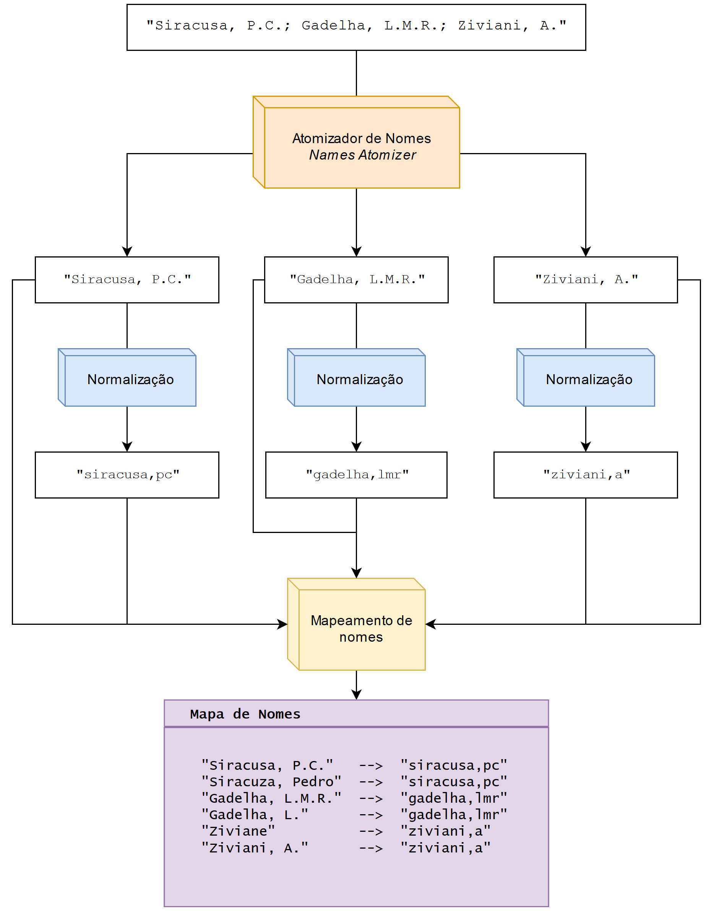
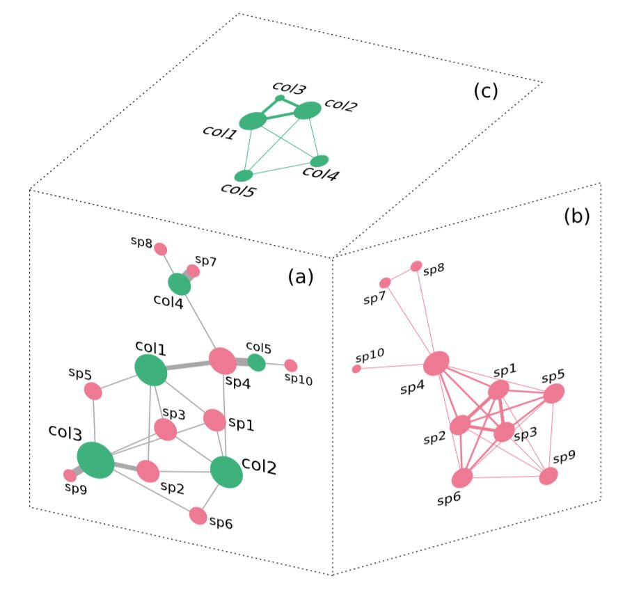
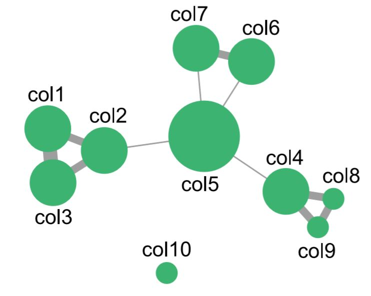

Em um artigo anterior fiz uma breve caracterização das [redes sociais por trás do Herbário da UnB](https://medium.com/@pedrosiracusa/a-redes-sociais-por-tr%C3%A1s-do-herb%C3%A1rio-da-unb-e08980f049dc), mostrando uma nova perspectiva de aplicação para dados de coleções biológicas. Tal abordagem consiste em derivar interações sociais de colaboração entre coletores e caracterizar seus interesses taxonômicos a partir de registros de ocorrências de espécies, e incorpora conceitos e ferramentas vindos do campo de analítica de redes sociais.
Tive a oportunidade de desenvolver estas ideias durante minha [pesquisa de mestrado](https://tede.lncc.br/handle/tede/279), que resultou na síntese de dois modelos baseados em redes: as **Redes Espécie-Coletor (SCN)**; e as **Redes de Colaboração de Coletores (CWNs)**. Caso você ainda não tenha ouvido falar nestes modelos, recomendo a leitura do meu [artigo de divulgação](https://medium.com/@pedrosiracusa/a-redes-sociais-por-tr%C3%A1s-do-herb%C3%A1rio-da-unb-e08980f049dc) antes de continuar.

Neste artigo demonstrarei o processo de construção destes modelos em 3 etapas, a partir de um conjunto de dados de ocorrência de espécies e usando a biblioteca [**Caryocar**](https://github.com/pedrosiracusa/caryocar/) (escrita na linguagem *Python*). Aqui usarei novamente o conjunto de [dados do Herbário da UnB](https://www.gbif.org/dataset/d82d5a18-0428-4e52-be16-f509153e8126) (sigla UB), que podem ser baixados através da plataforma GBIF.

Vamos começar importando as classes que implementam os modelos SCN e CWN:


```python
from caryocar.models import CWN, SCN
```

O pacote Caryocar também fornece algumas funções e classes auxiliares para realizar a limpeza dos dados.


```python
from caryocar.cleaning import NamesAtomizer, namesFromString
from caryocar.cleaning import normalize, read_NamesMap_fromJson
from caryocar.cleaning import getNamesIndexes
```

## Etapa 1. Leitura do conjunto de dados

O primeiro passo é ler o conjunto de dados de ocorrência de espécies.
Para isso vamos extender as funcionalidades da linguagem *Python* usando uma biblioteca muito útil para a análise de dados: a [Pandas](https://pandas.pydata.org/).
Com esta biblioteca, podemos carregar, transformar e analisar nosso conjunto de dados no ambiente de programação.


```python
import pandas as pd
```

Com a função `read_csv` do *Pandas*, carregaremos nossos dados que estão no arquivo CSV e os colocaremos na estrutura de um *Data Frame*, que é basicamente uma tabela.
Esta função espera receber o nome do arquivo CSV que contém os dados, bem como uma lista com os nomes das colunas que estamos interessados em carregar.
Especificarei o caminho para o arquivo na variável `dsetPath` e a lista das colunas de interesse em `cols`.
O dataframe ficará armazenado na variável `occs_df`.
Para deixar este artigo o mais simples possível usarei apenas os campos essenciais:
* `recordedBy`: Armazena os nomes dos coletores responsáveis pelo registro. Caso haja mais que 1 coletor, os nomes são separados por ponto-e-vírgula;
* `species`: Armazena o nome científico, a nível de espécie, determinado para o espécime em questão.


```python
dsetPath = '/home/pedro/datasets/ub_herbarium/occurrence.csv'
cols = ['recordedBy','species']

occs_df = pd.read_csv(dsetPath, sep='\t', usecols=cols)
```

Vamos dar uma olhada no jeitão do dataframe. Para isso, vamos pedir as 10 primeira linhas apenas.


```python
occs_df.head(10)
```


<div>
<style scoped>
    .dataframe tbody tr th:only-of-type {
        vertical-align: middle;
    }

    .dataframe tbody tr th {
        vertical-align: top;
    }

    .dataframe thead th {
        text-align: right;
    }
</style>
<table border="0" class="table">
  <thead>
    <tr style="text-align: left;">
      <th></th>
      <th>species</th>
      <th>recordedBy</th>
    </tr>
  </thead>
  <tbody>
    <tr>
      <th>0</th>
      <td>Lychnophora pinaster</td>
      <td>Ferreira, VF</td>
    </tr>
    <tr>
      <th>1</th>
      <td>Lychnophora pinaster</td>
      <td>Ferreira, VF</td>
    </tr>
    <tr>
      <th>2</th>
      <td>Lychnophora pinaster</td>
      <td>Ferreira, VF</td>
    </tr>
    <tr>
      <th>3</th>
      <td>Lychnophora pinaster</td>
      <td>Irwin, HS</td>
    </tr>
    <tr>
      <th>4</th>
      <td>Arundo donax</td>
      <td>Gomes, SM; Silva, ALH</td>
    </tr>
    <tr>
      <th>5</th>
      <td>Arundo donax</td>
      <td>Gomes, SM; Silva, ALH</td>
    </tr>
    <tr>
      <th>6</th>
      <td>Terminalia fagifolia</td>
      <td>Viana, G</td>
    </tr>
    <tr>
      <th>7</th>
      <td>Dimorphandra mollis</td>
      <td>Heringer, EP</td>
    </tr>
    <tr>
      <th>8</th>
      <td>Dimorphandra mollis</td>
      <td>Heringer, EP</td>
    </tr>
    <tr>
      <th>9</th>
      <td>Caesalpinia echinata</td>
      <td>Heringer, EP</td>
    </tr>
  </tbody>
</table>
</div>


---

## Etapa 2: Limpeza dos dados

Antes de construir o modelo, precisamos fazer uma limpeza de dados para garantir que eles estejam no formato adequado para a construção dos modelos. 
O primeiro passo é filtrar os registros com elementos nulos (`NaN`) para cada um dos campos do dataframe. Um elemento nulo significa ausência de informação, e portanto não ajudará muito na construção dos nossos modelos.
Vejamos o número de nulos em cada campo:


```python
occs_df.isnull().sum()
```


    [OUTPUT] 

    species       32711
    recordedBy        9
    dtype: int64


A informação de coletor está ausente em apenas 9 dos registros. Vamos simplesmente eliminá-los. Um outro ponto é que para simplificar nossa modelagem, vou apenas usar registros que tenham sido identificados ao nível de espécie. Isso significa que teremos que descartar 32711 registros, nos quais a informação sobre a identidade de espécie está ausente.


```python
occs_df.dropna(how='any', inplace=True)
```

Agora não temos mais nulos em nenhuma das colunas, e podemos prosseguir:


```python
occs_df.isnull().sum()
```


    [OUTPUT] 

    species       0
    recordedBy    0
    dtype: int64


### Atomização dos nomes de coletores

O campo de coletores (`recordedBy`) é fundamental para nossa modelagem, mas infelizmente costuma ser um pouco problemático.
O primeiro problema é que os nomes dos coletores não são **atômicos**. Isso significa múltiplos nomes podem ser codificados em um mesmo valor (no caso, a lista de nomes é codificada como uma única *string*, sendo cada nome separado por um ponto-e-vígula). 

Segundo as recomendações do [*Biodiversity Information Standards (TDWG)*](https://www.tdwg.org/), nomes de coletores devem ser incluídos, em geral, usando a seguinte regra: sobrenome com a primeira letra maiúscula, seguido por vírgula e espaço e iniciais do nome em letras maiúsculas, separadas por pontos (ex. Proença, C.E.B.).
Além disso, o TDWG recomenda que o separador utilizado para delimitar nomes de coletore deva ser o caractere pipe ( `|` ).
No entanto, o caractere usado no dataset do UB é o ponto-e-vírgula.
Isso não será um grande problema no nosso caso, já que neste dataset o ponto-e-vírgula é usado de forma consistente, em quase todos os registros.

Para proceder com a atomização dos nomes utilizaremos uma classe auxiliar, chamada `NamesAtomizer`. Criaremos o objeto atomizador e atribuiremos à variável `na`. Passaremos a função `namesFromString` que especifica as regras usadas para separar os nomes.


```python
na = NamesAtomizer(atomizeOp=namesFromString)
```

O atomizador de nomes resolve a grande maioria dos casos. Mas existem alguns poucos registros com erros na delimitação dos nomes. Neste caso a correção deve ser feita fazendo a substituição em cada registro pela sua forma correta.
Para o dataset do UB, estas substituições estão especificadas no arquivo armazenado na variável `names_replaces_file`, abaixo:


```python
names_replaces_file = '/home/pedro/data/ub_collectors_replaces.json'
```

Só por curiosidade, vejamos o conteúdo deste arquivo:


```python
! cat {names_replaces_file}
```

    [OUTPUT] 

    {
        "_replaces": {
            "Barbosa; M.G.": "Barbosa, M.G.",
            "Bueno; S.B.": "Bueno, S.B.",
            "Carboni, M; Faraco, AG; Soares; P.G.; Sampaio, D; Breier, TB": "Carboni, M; Faraco, AG; Soares, P.G.; Sampaio, D; Breier, TB",
            "Hatschbach, G; M.": "Hatschbach, G; Hatschbach, M",
            "Hällström; E.": "Hällström, E.",
            "Irwin, HS; Souza, R; Santos; RR": "Irwin, HS; Souza, R; Santos, RR",
            "Kirkbride Junior, JH; Ono; E.K.M; et al.": "Kirkbride Junior, JH; Ono, E.K.M; et al.",
            "Quintiliano; F.J.; Colvéquia; L.P.T; Silva; D.R.": "Quintiliano, F.J.; Colvéquia, L.P.T; Silva, D.R.",
            "Silva; D.R.; Colvéquia; L.P.T": "Silva, D.R.; Colvéquia, L.P.T",
            "Sr. Air, Sr. Milton, Rodrigo": "Sr. Air; Sr. Milton; Rodrigo",
            "Sônia / Josefina": "Sônia; Josefina",
            "Yushun.; K.": "Yushun., K."
        }
    }

Prosseguindo com a substituição:


```python
na.read_replaces(names_replaces_file)
```

Agora, com o auxílio do atomizador de nomes, vamos adicionar uma nova coluna ao dataframe, contendo os nomes dos coletores atomizados. Ela se chamará `recordedBy_atomized`:


```python
occs_df['recordedBy_atomized'] = na.atomize(occs_df['recordedBy'])
```

### Normalização e mapeamento de nomes

Um segundo problema é que nomes de coletores podem ter sido escritos de algumas formas diferentes, seja por conta de erros ou omissão de partes do nome.
Por exemplo, o nome 'Proença, C.E.B.' pode ter alguns variantes, incluindo 'Proenca, C.E.B,', 'Proença, C.E.', Proença, C.'.
Precisamos pensar em uma forma para ligar todas essas variantes a um nome principal.

A solução para este problema até o momento é armazenar um mapa ligando cada variante a uma forma normal do nome. O processo de **normalização** inclui a transformação do nome para uma forma simplificada. Isso significa que só usaremos caracteres em caixa-baixo, omitiremos acentos e pontuações, e removeremos caracteres não-alfanuméricos. 
No exemplo citado acima, todos os nomes seriam mapeados para 'proenca,ceb'.

Para o conjunto de dados do UB, já tenho um mapa de nomes pronto, guardado no seguinte arquivo:


```python
namesMap_file = '/home/pedro/data/ub_namesmap.json'
```

Este arquivo é grande, mas vamos ver as 20 primeiras linhas para termos uma ideia:


```python
! head {namesMap_file} -n 20
```

    [OUTPUT] 

    {
        "_map_prim_norm": {
            ".": "",
            "1980 Sino-Amer Exped.": "sinoamerexped",
            "?": "",
            "A.J.N.V.": "ajnv",
            "A.M.": "am",
            "Abbas, B": "abbas,b",
            "Abdala, GC": "abdala,gc",
            "Abdo, MSA": "abdo,msa",
            "Abdon": "abdon",
            "Abe, LB": "abe,lb",
            "Abe, LM": "abe,lm",
            "Abrahim, MA": "abrahim,ma",
            "Abreu, CG": "abreu,cg",
            "Abreu, GX": "abreu,gx",
            "Abreu, I": "abreu,i",
            "Abreu, LC": "abreu,lc",
            "Abreu, LCR": "abreu,lcr",
            "Abreu, M": "abreu,m",


Note que alguns nomes de coletores que não eram nulos porêm remetem à falta da informação (por exemplo '.', '?') são mapeados para uma *string* vazia. Mais tarde iremos filtrar estes nomes.

Vamos agora ler o mapa de nomes do arquivo e armazená-lo na variável `nm`.


```python
nm = read_NamesMap_fromJson(namesMap_file, normalizationFunc=normalize)
```

Caso haja nomes de coletores que não estão no arquivo, vamos nos assegurar de que eles serão inseridos:


```python
collectors_names = list(set( n for n,st,num in na.getCachedNames() ))
nm.addNames(collectors_names)
```

Assim, este mapa nos permite buscar, para cada variante do nome, sua forma normal:


```python
nm.getMap()['Proença, CEB']
```


    [OUTPUT] 

    'proenca,ceb'


```python
nm.getMap()['Proença, C']
```


    [OUTPUT] 

    'proenca,ceb'


A figura abaixo ilustra as etapas envolvidas no preprocessamento do campo dos coletores, conforme descrito.

{:width="700px"}

### O índice de nomes

Finalmente, vamos construir um índice de nomes, apenas para mantermos a referência de quais linhas do dataframe cada coletor aparece. Para isso usaremos a função `getNamesIndexes`. Precisamos informar o nome do dataframe, o nome da coluna que armazena os nomes atomizados e o mapa de nomes. Mas enfatizo que este passo não é necessário para a construção dos modelos (apesar de ser útil para algumas análises).


```python
ni = getNamesIndexes(occs_df,'recordedBy_atomized', namesMap=nm.getMap())
```

---

## Etapa 3: Construindo os modelos

Chegamos na etapa que realmente interessa. Já temos um dataframe com os dados minimamente limpos e estruturados, e podemos então construir os modelos!

## Rede Espécie-Coletor (SCN)

Redes espécie-coletor modelam relações de interesse, envolvendo necessariamente um **coletor** e uma **espécie**. A semântica destas relações pode ser descrita como `coletor -[registra]-> espécie` ou, por outro lado, `espécie-[é registrada por]-> coletor`. A figura abaixo exemplifica esta estrutura (a).

Como o modelo envolve duas classes de entidades (coletores e espécies), existem duas perspectivas adicionais que podem ser exploradas: Podemos investigar o quão fortemente dois coletores estão associados entre si em termos de seus interesses em comum (b); bem como quão fortemente duas espécies estão associadas entre si em termos do conjunto de coletores que as registram (c).

Nos referimos às perspectivas (b) e (c) como **projeções** da rede (a). Estas projeções são obtidas simplesmente ligando entidades da mesma classe tomando como base o número de entidades da classe oposta que eles compartilham, na estrutura (a).

{:width="500px"}

Vamos então ao código. Construiremos a rede espécie-coletor usando a classe `SCN`, disponível no pacote Caryocar. Para sua construção, devemos fornecer:
* Uma lista de espécies, neste caso a coluna do dataframe `occs_df['species']`;
* Uma lista contendo listas de coletores, neste caso a coluna do dataframe `occs_df['recordedBy_atomized']`;
* Um mapa de nomes.


```python
scn = SCN(species=occs_df['species'], collectors=occs_df['recordedBy_atomized'], namesMap=nm)
```

Após a construção do modelo, vamos remover nomes de coletores indevidos, como 'etal', 'ilegivel', 'incognito'.


```python
cols_to_filter = ['','ignorado','ilegivel','incognito','etal']
scn.remove_nodes_from(cols_to_filter)
```

Vejamos então um pequeno resumo sobre esta rede. Este pedaço de código pode ser um pouco feio, mas o que importa mesmo aqui são as informações imprimidas abaixo dele.


```python
n_cols = len(scn.listCollectorsNodes())
cols_degrees = scn.degree(scn.listCollectorsNodes())
n_spp = len(scn.listSpeciesNodes())
spp_degrees = scn.degree(scn.listSpeciesNodes())

print(
f"""Rede Espécie-Coletor (SCN)
==========================
Número total de coletores:{n_cols}
Número total de espécies: {n_spp}
Em média, um coletor registra {round( sum( k for n,k in cols_degrees)/n_cols)} espécies distintas
Em média, uma espécie é registrada por {round( sum( k for n,k in spp_degrees)/n_spp)} coletores distintos
Número total de arestas: {len(scn.edges)}\n""")
print("Top-10 coletores mais produtivos:")
for n,k in sorted(cols_degrees,key=lambda x:x[1],reverse=True)[:10]:
    print(f"  {n} ({k} especies distintas)")
print("\nTop-10 espécies coletadas:")
for n,k in sorted(spp_degrees,key=lambda x:x[1],reverse=True)[:10]:
    print(f"  {n} ({k} coletores distintos)")
```

    [OUTPUT] 

    Rede Espécie-Coletor (SCN)
    ==========================
    Número total de coletores:6795
    Número total de espécies: 15374
    Em média, um coletor registra 21 espécies distintas
    Em média, uma espécie é registrada por 9 coletores distintos
    Número total de arestas: 143861
    
    Top-10 coletores mais produtivos:
      irwin,hs (4557 especies distintas)
      heringer,ep (2595 especies distintas)
      anderson,wr (2163 especies distintas)
      proenca,ceb (1906 especies distintas)
      ratter,ja (1805 especies distintas)
      faria,jeq (1764 especies distintas)
      eiten,g (1598 especies distintas)
      souza,rr (1555 especies distintas)
      harley,rm (1514 especies distintas)
      santos,rrb (1510 especies distintas)
    
    Top-10 espécies coletadas:
      Myrcia splendens (388 coletores distintos)
      Myrcia guianensis (318 coletores distintos)
      Eugenia punicifolia (264 coletores distintos)
      Casearia sylvestris (258 coletores distintos)
      Palicourea rigida (241 coletores distintos)
      Myrcia tomentosa (239 coletores distintos)
      Qualea parviflora (232 coletores distintos)
      Solanum lycocarpum (228 coletores distintos)
      Piper aduncum (211 coletores distintos)
      Miconia albicans (201 coletores distintos)


Um aspecto interessante a ser notado é a distribuição de grau (número de conexões de um vértice) nesta rede.
Embora em média um coletor registre 21 espécies diferentes, os coletores mais produtivos registraram mais de 1000!
De forma simlar, embora em média uma espécie seja registrada por 9 coletores distintos, as primeiras 10 foram registradas por mais de 200 coletores cada.
Embora esteja fora do escopo deste artigo, é fácil mostrar que a distribuição desta rede está longe de ser normal. Na verdade, é aproximada por uma lei de potência.

Isso significa que enquanto uma grande maioria de coletores registra pouquíssimas espécies diferentes, alguns poucos (chamados *hubs*, ou coletores-chave) registram um número muito acima da média.
De forma análoga enquanto uma grande maioria de espécies foi coletadas por apenas um ou poucos coletores diferentes, algumas poucas foram coletadas por um grande número de coletores distintos.

## Rede de Colaboração de Coletores (CWN)

Redes de colaboração de coletores (CWNs), como o nome sugere, modelam relações de colaboração que se estabelecem entre coletores enquanto registram espécies em campo. Uma ligação entre pares de coletores é criada ou fortalecida cada vez que eles co-autoram um registro de espécie. Sendo assim, a semântica destas relações é descrita como `coletor -[coleta espécime com]-> coletor`. A figura abaixo ilustra a estrutura destas redes. É importante notar que, diferente das SCNs, nas CWNs a identidade taxonômica de cada registro não é representada em sua estrutura. Coletores que nunca colaboraram aparecem como vértices isolados na rede.

{:width="300px"}

O pacote Caryocar também fornece a classe `SCN`, que facilita a construção de redes de colaboração de coletores. Para sua construção, devemos fornecer:

* Uma lista contendo listas de coletores (cliques), neste caso a coluna do dataframe `occs_df['recordedBy_atomized']`;
* Um mapa de nomes.


```python
cwn = CWN(cliques=occs_df['recordedBy_atomized'],namesMap=nm)
```

Assim como fizemos com a SCN, vamos remover nomes de coletores indevidos


```python
cols_to_filter = ['','ignorado','ilegivel','incognito','etal']
cwn.remove_nodes_from(cols_to_filter)
```

Vejamos um resumo sobre a rede:


```python
n_cols = len(cwn.nodes)
cols_degrees = cwn.degree()

print(
f"""Rede de Colaboração de Coletores (CWN)
======================================
Número total de coletores:{n_cols}
Número total de arestas: {len(cwn.edges)}
Em média, um coletor colabora com {round( sum(k for n,k in cols_degrees)/n_cols )} pares ao longo de sua carreira
No total {len([ n for n,k in cols_degrees if k==0 ])} coletores nunca colaboraram
No total, {len([ n for n,k in cols_degrees if k>3 ])} coletores colaboraram com mais que 3 colegas\n""")
print("Top-10 coletores mais colaborativos:")
for n,k in sorted(cols_degrees,key=lambda x:x[1],reverse=True)[:10]:
    print(f"  {n} ({k} colegas)")
    
print("\nTop-10 coletores sem colaborações com maior número de registros:") 
for n,k, in sorted([ (n,d['count']) for n,d in cwn.nodes(data=True) if cwn.degree(n)==0 ],key=lambda x: x[1], reverse=True)[:10]:
    print(f"  {n} ({cwn.nodes[n]['count']} registros, 0 colaborações)")
```

    [OUTPUT] 

    Rede de Colaboração de Coletores (CWN)
    ======================================
    Número total de coletores:6795
    Número total de arestas: 10435
    Em média, um coletor colabora com 3 pares ao longo de sua carreira
    No total 2684 coletores nunca colaboraram
    No total, 1578 coletores colaboraram com mais que 3 colegas
    
    Top-10 coletores mais colaborativos:
      proenca,ceb (219 colegas)
      faria,jeq (119 colegas)
      ratter,ja (111 colegas)
      munhoz,cbr (109 colegas)
      silva,ma (93 colegas)
      oliveira,rc (92 colegas)
      harley,rm (90 colegas)
      mendes,vc (89 colegas)
      souza,vc (89 colegas)
      carvalho,avm (88 colegas)
    
    Top-10 coletores sem colaborações com maior número de registros:
      leite,alta (2094 registros, 0 colaborações)
      touw,a (375 registros, 0 colaborações)
      schiffner,v (283 registros, 0 colaborações)
      oliveira,e (258 registros, 0 colaborações)
      coelho,gsf (227 registros, 0 colaborações)
      rocha,mal (162 registros, 0 colaborações)
      aquino,ppu (155 registros, 0 colaborações)
      pinto,rnm (144 registros, 0 colaborações)
      silva,nf (133 registros, 0 colaborações)
      rios,mns (133 registros, 0 colaborações)


## Considerações finais

Meu objetivo neste artigo foi demonstrar o processo de construção dos modelos SCN e CWN a partir de um conjunto de dados de ocorrência de espécies, usando o pacote Caryocar.
Mostrei também como proceder com a limpeza dos dados de ocorrência de espécies, fazendo todas as transformações necessárias para que o conjunto de dados torne-se adequado para a modelagem.

Um ponto a ser ressaltado é sobre a importância em se verificar a qualidade do campo do coletor, normalmente subutilizado na maioria das aplicações de dados de coleções biológicas.
Dentre os problemas mais comuns estão a inclusão apenas do coletor principal (sendo os coletores auxiliares omitidos ou agrupados no nome 'et. al'), o não-cumprimento dos padrões recomendados para a escrita dos nomes, e a ausência de identificadores únicos para a distinção dos coletores.
De forma geral, estes fatores são a maior limitação para a construção dos modelos.
A alta qualidade deste campo no conjunto de dados do herbário da UnB foi um dos fatores decisivos para que fosse escolhido como prova de conceito.

Os modelos SCN e CWN permitem investigar o aspecto humano envolvido na formação de coleções biológicas, e portanto abrem portas para novos tipos de análises e aplicações para dados de ocorrência de espécies.
Pretendo explorar e demonstrar algumas dessas possibilidades em artigos futuros.
